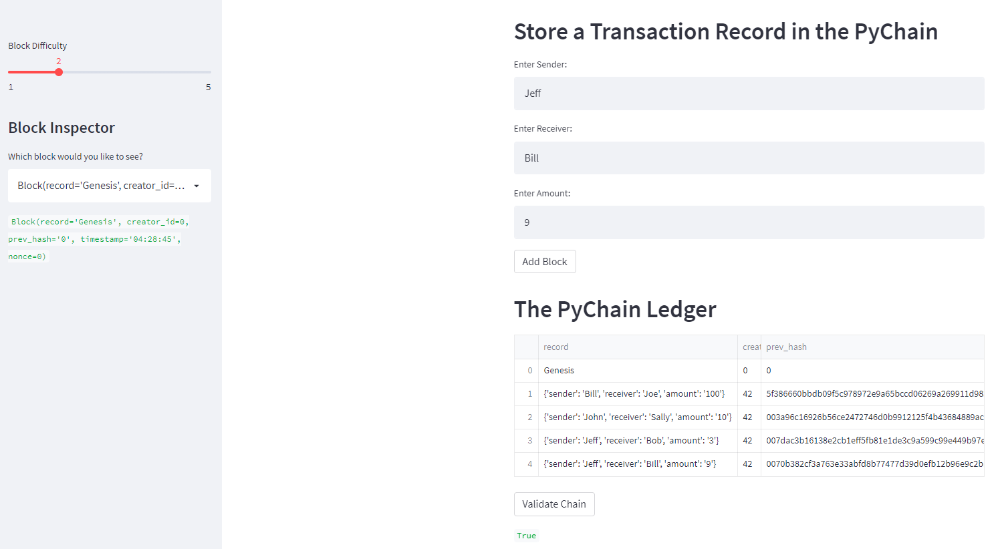

# fintech18_blockchain

This is my homework submission for week 18 of the fintech bootcamp. In this exercise, a streamlit application simulating a blockchain is deployed.

See following screenshot for a sample ledger, with 4 blocks added. The web app includes validation to check that the chain is valid.

